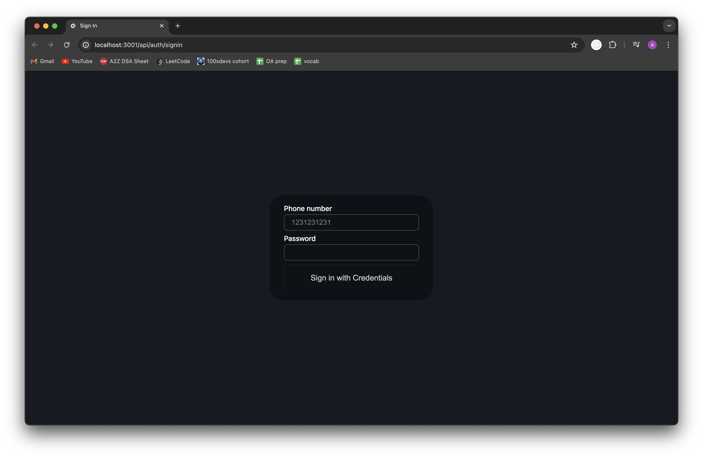
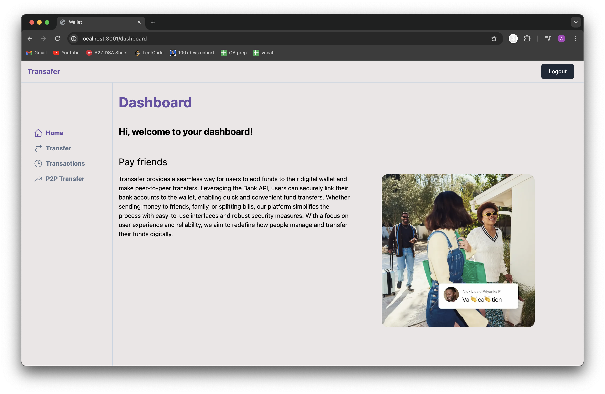
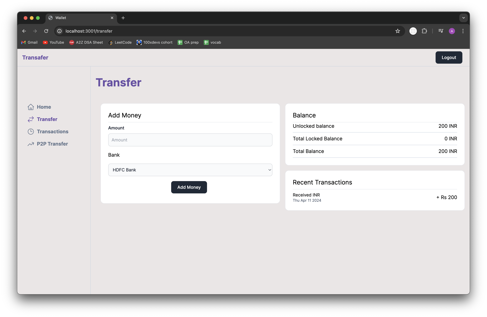
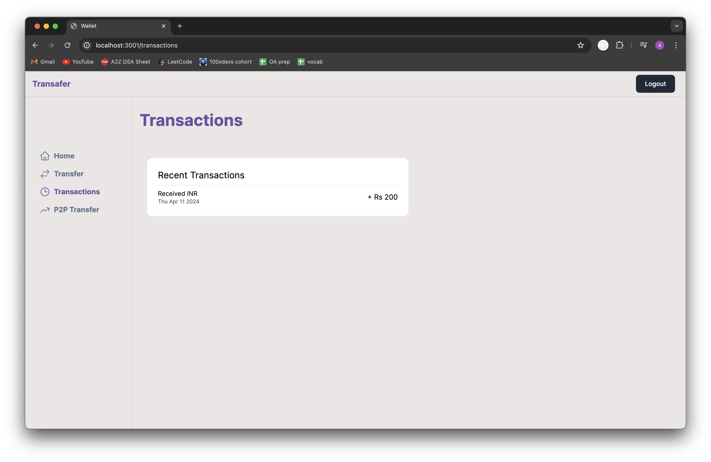
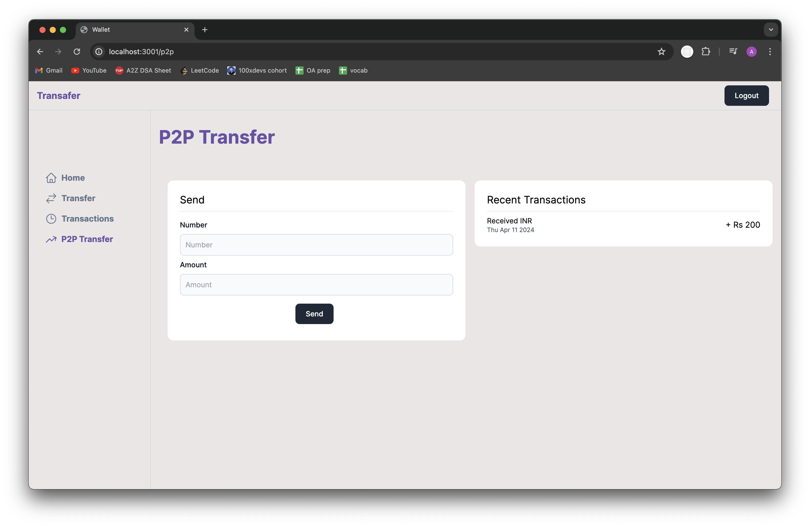
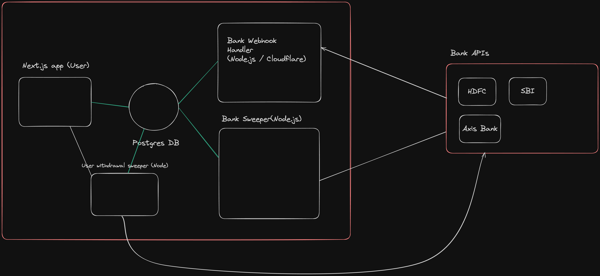

# Transafer: A Next.js Digital Wallet

Transafer is a modern digital wallet application built with Next.js, Tailwind CSS, and TypeScript. It allows users to sign up, sign in, transfer money to other users, and add money to their wallets. The application integrates with real banks using dummy endpoints created with Express.js. Transafer provides a secure and user-friendly platform for managing finances online.

## Features

### 1. Signup/Signin


- **Description:** Easily create a new account or sign in to your existing account.

### 2. Dashboard


- **Description:** The dashboard provides users with a comprehensive overview of their account. 

### 3. Transfer


- **Description:** The transfer page allows users to add money to their wallet from different banks. Users can choose the bank from which they want to add money, providing flexibility and convenience.

### 4. Transactions


- **Description:** The transactions page provides users with a detailed list of all their transactions. Users can see the date and amount of each transaction. 

### 5. P2P Transfer


- **Description:** The P2P transfer feature allows users to transfer money to another person using their mobile number. Users can easily send money to friends, family, or anyone else in their contact list, making payments quick and hassle-free.

## System Architecture


-  **Description:** The system architecture of the Transafer digital wallet application consists of several key components that work together to provide a seamless and secure user experience.

- **Frontend (Next.js):** The frontend of the application is built using Next.js, a React framework. It provides the user interface for interacting with the application, including sign-in, sign-up, dashboard, transfer page, transactions page, and P2P transfer page.
- **Backend (Express.js):** The backend of the application is implemented using Express.js, a Node.js framework. It provides the business logic and data management for the application, including handling user authentication, processing transactions, and interacting with the database.
- **Database (PostgreSQL):** The application uses PostgreSQL as the database to store user data, transaction history, and other relevant information. PostgreSQL provides a reliable and scalable solution for managing the application's data.
- **Prisma:** Prisma is used as the ORM (Object-Relational Mapping) tool to interact with the PostgreSQL database. It simplifies database access and management, allowing for efficient querying and data manipulation.
- **Middleware:** Middleware functions are used in Express.js to handle common tasks such as logging, error handling, and request processing. Middleware helps to streamline the application's workflow and improve its performance and reliability.
- **Dummy Endpoints:** Express.js is used to create dummy endpoints that simulate how banks add money to the digital wallet. These endpoints are used for testing and demonstration purposes only and do not interact with real banking systems.
- **Monorepo:** The application is structured as a monorepo, allowing for the management of multiple packages or modules within a single repository. This helps to organize the codebase and streamline the development process.
Overall, the system architecture of the Transafer digital wallet application is designed to be scalable, secure, and efficient, providing users with a seamless and reliable platform for managing their finances online.

## Getting Started

### 1. Clone the Repository

```bash
git clone https://github.com/aadarsharma/Transafer.git
```

### 2. Install Dependencies

```bash
npm install
```

### 3. Run PostgreSQL

You can run PostgreSQL either locally or on the cloud. For local development, you can use Docker with the following command:

```bash
docker run -e POSTGRES_PASSWORD=mysecretpassword -d -p 5432:5432 postgres
```

### 4. Copy and Update Environment Variables

Copy over all `.env.example` files to `.env` and update the `.env` files with the correct database URL.

### 5. Run Prisma Migrations

Navigate to the `packages/db` directory and run the following commands:

```bash
npx prisma migrate dev
npx prisma db seed
```

### 6. Start the User App

Navigate to the `apps/user-app` directory and run the following command to start the application:

```bash
npm run dev
```

### 7. Login to the Application

Try logging in using the following credentials:

- Phone: 1111111111
- Password: alice (See `seed.ts` for more details)
