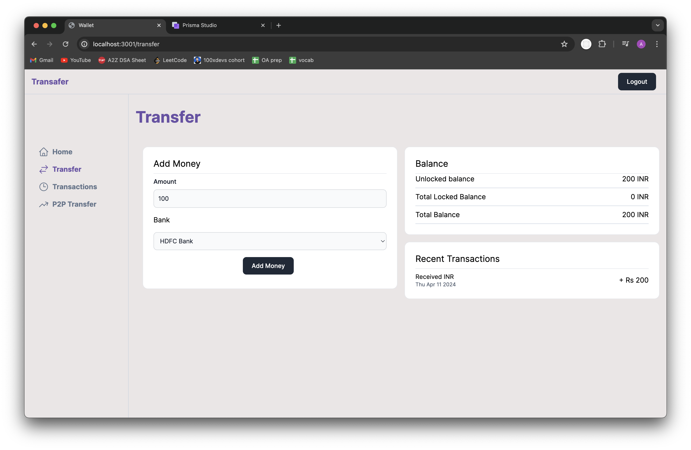
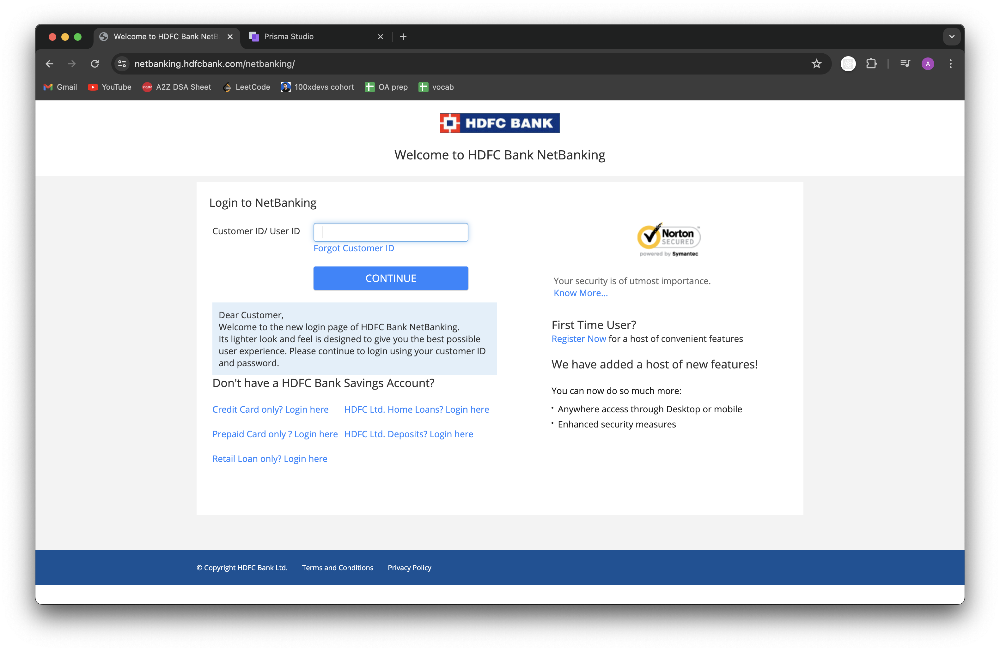
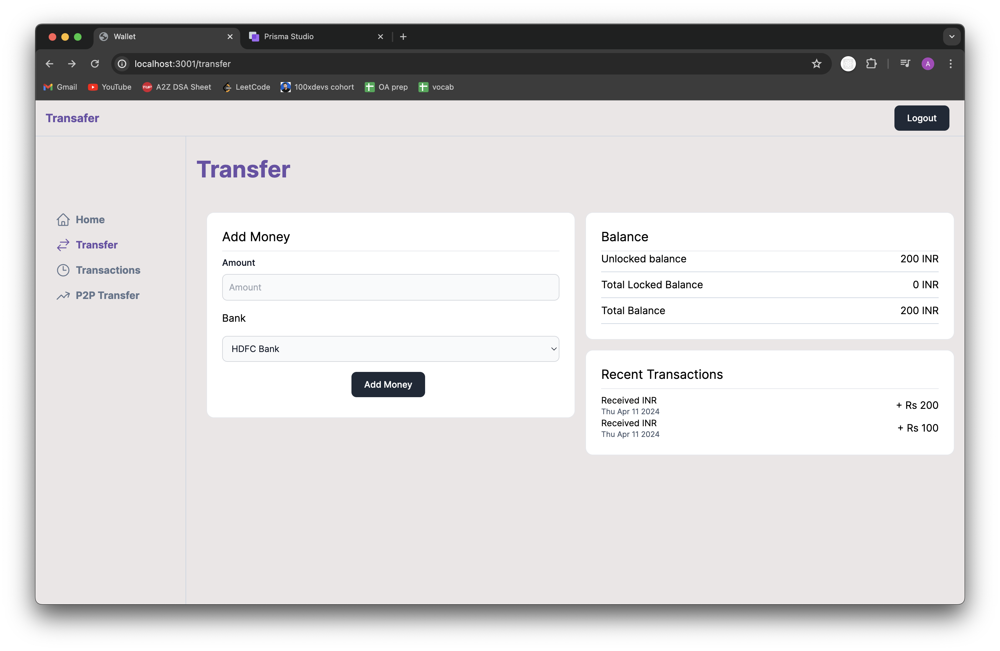
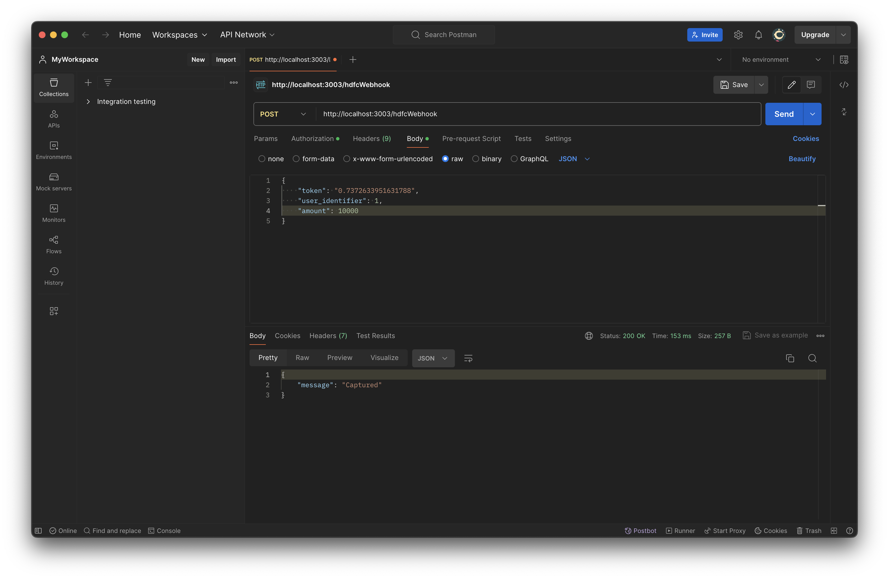
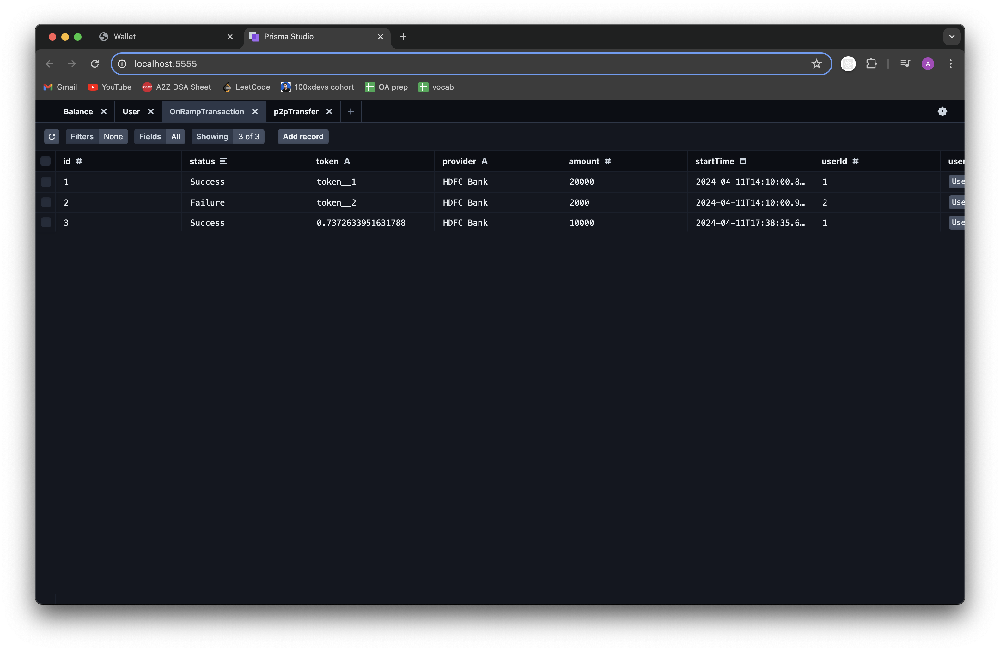
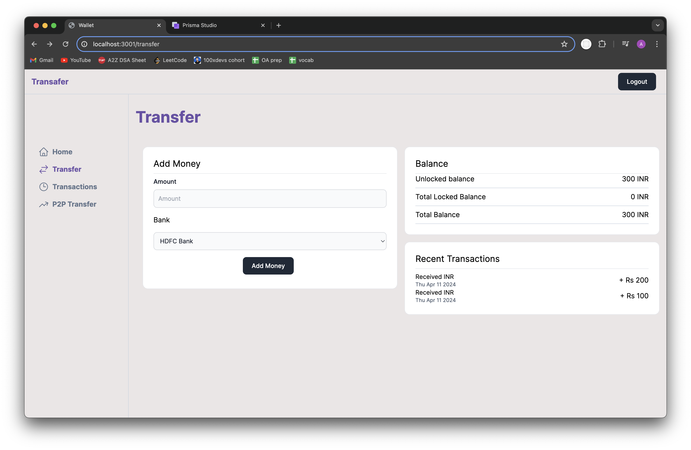

# Working of the Dummy Endpoints

### 1. Adding Money

- **Select Bank and Amount:** Choose the bank from which you want to add money and specify the amount you wish to add.
- **Initiate Transaction:** Click on the "Add Money" button to initiate the transaction. This will redirect you to the bank's authorization page.

### 2. Bank's Authorisation Page

- **Dummy Bank's Authorization Page:** This is a screenshot of where the user gets redirected when clicking on "Add Money" if the selected bank is "HDFC Bank".

### 3. Money Not Added to Wallet Yet

- **Money Did Not Get Added to Wallet on User-Side Yet** Rs. 100 did not get added to the wallet because the request hasn't been fetched by the bank server.

### 4. Prisma

- **Database State:** The database still shows the status as "processing Rs. 100". The amount is stored multiplied by a value to avoid inconsistencies in data.

### 5. Postman

- **Authorize Request:** Provide the required information, including user_identifier, token, and amount, to authorize the request.
- **Transaction Confirmation:** After authorizing the request, you will receive a "captured" message, indicating that the transaction has been successfully processed.

### 6. Transaction Confirmation

- **Success:** As the transaction confiramtion happens the database updates the status as "Success".

### 7. Money added to wallet

- **Check Wallet Balance:** You can now check your wallet balance to confirm that the money has been added successfully.
- **View Transaction History:** The transaction will also be recorded in your transaction history, allowing you to track your financial activities.
